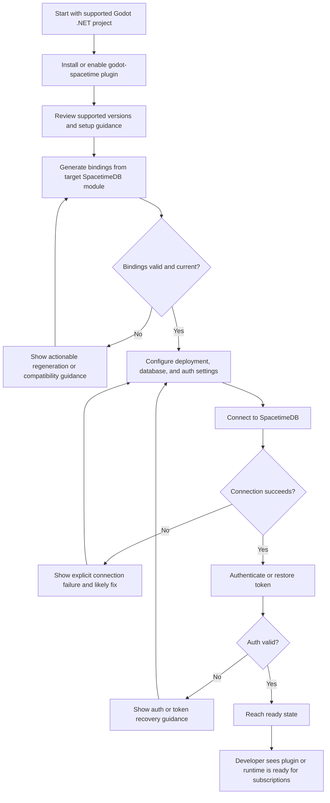
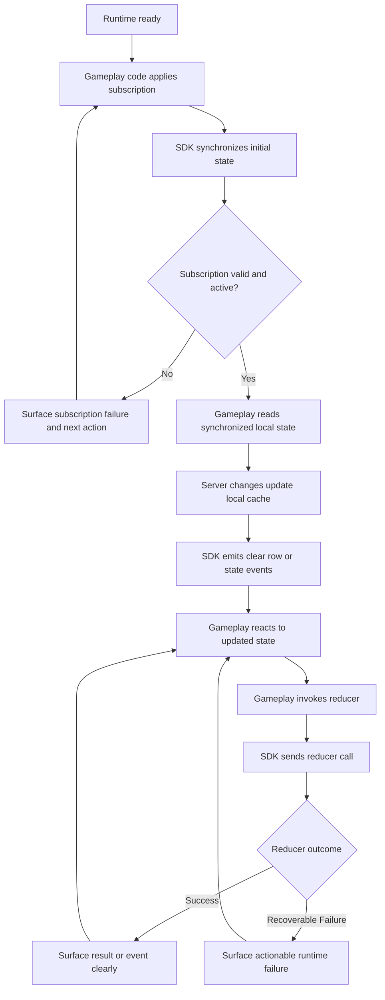
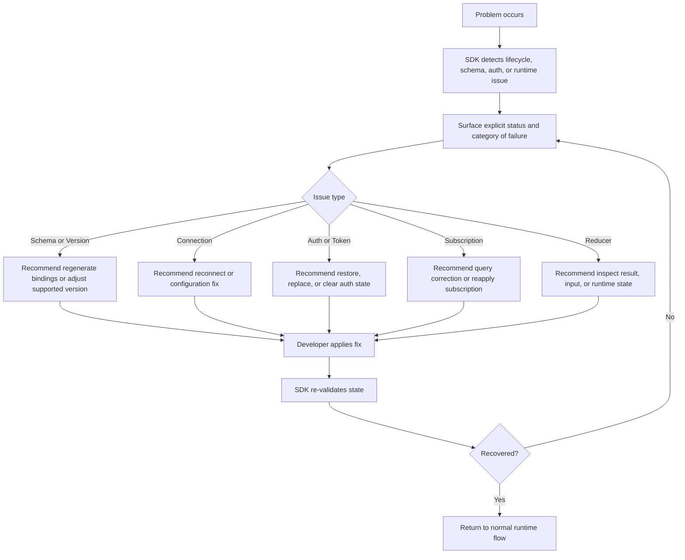

# UX Design Specification godot-spacetime

**Author:** Pinkyd
**Date:** 2026-04-10

---

<!-- UX design content will be appended sequentially through collaborative workflow steps -->

## Executive Summary

### Project Vision

godot-spacetime should provide a Godot-native translation of the official SpacetimeDB Unity plugin experience for v1. The goal is workflow parity and capability parity with the official Unity/C# plugin path, delivered first through a `.NET` runtime that feels production-credible rather than experimental.

The product should close the trust gap that currently exists for Godot developers. Instead of offering only the bare essentials or example-driven integration, it should give developers a maintained, documented, sample-backed SDK that covers the full expected first-use path: installation, binding generation, connection, authentication or token resume, subscriptions, local cache access, row callbacks, reducer invocation, troubleshooting, and compatibility guidance.

The long-term product model should stay runtime-neutral. `.NET` ships first, but future native `GDScript` support should extend the same core mental model rather than replace it with a separate product concept.

### Target Users

The primary users are Godot developers building real projects who want to use SpacetimeDB without maintaining custom protocol-layer code. They need an SDK they can trust for practical development, not just for experimentation.

A secondary user group is external Godot developers evaluating whether SpacetimeDB is a serious option for their engine of choice. For them, credibility depends on clear onboarding, version support, working examples, and alignment with official SpacetimeDB concepts.

A third important audience is maintainers and contributors who need the SDK to remain coherent across releases, supported versions, and future runtime expansion into native `GDScript`.

### Key Design Challenges

The first challenge is translating the official Unity plugin workflow into Godot without reducing it to a literal API copy or inventing a disconnected Godot-only model. The UX has to preserve official SpacetimeDB concepts while still feeling natural in Godot.

The second challenge is that every stage of first adoption matters. Installation, code generation, connection setup, auth flow, subscriptions, reducer usage, troubleshooting, and version compatibility all contribute to whether the SDK feels trustworthy.

The third challenge is protecting future multi-runtime continuity. The `.NET` implementation must be complete enough for v1, but the conceptual model must not trap the product in `.NET`-only assumptions that make later `GDScript` support awkward or fragmented.

The fourth challenge is overcoming the perception created by existing community solutions that provide only bare essentials, partial coverage, or drifting documentation. The UX must make maintenance quality and support clarity visible.

### Design Opportunities

The biggest opportunity is to use the official Unity plugin as the reference mental model, giving developers a familiar and transferable SpacetimeDB workflow in Godot.

A second opportunity is to turn example-based capability into a production-credible developer experience through consistent docs, compatibility guidance, sample-backed onboarding, and clearer recovery paths when setup or runtime issues occur.

A third opportunity is to define one stable product experience across `.NET` and future `GDScript`, so runtime expansion increases reach without fragmenting the SDK’s identity or forcing developers to relearn the product.

## Core User Experience

### Defining Experience

The core experience of godot-spacetime is enabling a Godot developer to use SpacetimeDB as part of normal game development without having to think about transport or protocol plumbing. The SDK exists for one reason: to make SpacetimeDB usable from Godot in a way that feels as credible and complete as the official Unity plugin path.

The most frequent and most important user actions are subscribing to live data and calling reducers from gameplay code. Everything else in the product exists to support those actions: installation, code generation, connection setup, authentication, token reuse, cache synchronization, error reporting, and compatibility guidance.

If the UX succeeds, a developer should be able to treat SpacetimeDB integration as normal Godot application work. They should move from generated bindings to connection, from connection to subscriptions, from subscriptions to local cache reads, and from gameplay actions to reducer calls without the SDK feeling like a separate system they have to fight.

### Platform Strategy

The v1 shipping platform is Godot `.NET`, used in the desktop editor and supported desktop runtime targets. That is the primary delivery context and the experience should be optimized accordingly.

Web is not a valid v1 runtime target because Godot `.NET` does not support that export path. However, web still matters strategically and should be accounted for in the UX plan by protecting a future native `GDScript` implementation path. The product experience should therefore be designed around runtime-neutral concepts even while `.NET` is the only shipping runtime at first.

The platform strategy is to ship a `.NET` experience that is complete enough to stand beside the official Unity plugin, while making sure future `GDScript` support can follow the same conceptual workflow for onboarding, bindings, connection lifecycle, subscriptions, cache usage, and reducer interactions.

### Effortless Interactions

Subscribing to data and calling reducers should feel direct, obvious, and dependable. Developers should not need to invent extra infrastructure just to keep gameplay state synchronized with SpacetimeDB.

The surrounding lifecycle should also feel effortless. Installation and initial setup should be clear. Code generation should be repeatable. Connection and authentication should be straightforward. Token restore, reconnect behavior, cache synchronization, and schema or version mismatch detection should happen through supported automatic flows rather than manual recovery work wherever possible.

The ideal interaction model is that routine operational concerns are handled by the SDK, while developers stay focused on their game logic. Where automation cannot safely decide for the user, the SDK should still make the next step obvious through explicit guidance and visible status.

### Critical Success Moments

There is not just one success moment in this product. Trust is built through a chain of success moments that all need to work together.

The first success moment is reaching a valid first connection from a supported Godot project. The second is seeing a live subscription populate and update usable state inside Godot. The third is invoking a reducer from gameplay code and receiving a clear, understandable result that fits normal application flow.

These moments are also the make-or-break flows. If installation is confusing, if code generation drifts, if auth or token reuse fails, if subscription and cache behavior become silent or ambiguous, or if reducer results are unclear, trust collapses quickly. Because of that, all major onboarding and runtime flows must be treated as critical UX moments rather than secondary implementation details.

### Experience Principles

- Preserve official-model parity: match the official Unity plugin workflow and capabilities at the experience level, while adapting them to Godot rather than copying surface syntax literally.
- Optimize for the real core loop: prioritize subscriptions, synchronized local state, and reducer invocation as the center of the developer experience.
- Make lifecycle support invisible when possible: token restore, reconnect behavior, cache sync, and compatibility checks should work automatically wherever safe and practical.
- Never fail silently: installation, code generation, auth, subscription, cache, and reducer issues must surface clearly enough that developers know what happened and what to do next.
- Protect one product model across runtimes: `.NET` is the v1 delivery runtime, but the UX language and mental model should remain stable enough to extend into native `GDScript` later.

## Desired Emotional Response

### Primary Emotional Goals

godot-spacetime should make developers feel confident, in control, clear about what the SDK is doing, and relieved that they do not need to build or debug a custom client layer themselves. The emotional goal is not excitement for its own sake. It is professional trust in a tool that feels complete, capable, and dependable.

The strongest differentiator is the sense that this is a complete solution. Compared with half-baked or partially maintained alternatives, the SDK should feel like the version a serious Godot developer can actually adopt for real work.

After users achieve the core loop of connecting, subscribing, and invoking reducers successfully, they should feel accomplished. The product should reinforce the sense that they now have a usable backend integration foundation rather than a fragile experiment.

### Emotional Journey Mapping

When developers first discover the product, they should feel cautious optimism that Godot finally has a serious SpacetimeDB path. Early onboarding should quickly turn that into trust by making support boundaries, setup flow, and compatibility expectations explicit.

During the core experience, users should feel focused and in control. Generated bindings, subscriptions, cache access, and reducer calls should feel understandable enough that users always know what state the SDK is in and what action comes next.

After completing their task, users should feel accomplished and unblocked. The emotional outcome should be, "this works, I understand it, and I can build on it," not just "I got lucky and made the sample run."

When something goes wrong, the desired emotional response is not calm through abstraction. It is confidence through clarity: users should feel that they know what happened and know how to fix it. On return use, the product should feel familiar, stable, and predictable.

### Micro-Emotions

The most important micro-emotions for this product are confidence over confusion, trust over skepticism, clarity over ambiguity, and accomplishment over frustration.

A smaller but still important emotional goal is relief. Developers should feel relieved that routine but error-prone infrastructure concerns like token reuse, reconnect behavior, cache synchronization, and compatibility checks are handled in a supported way instead of becoming custom maintenance work.

The most important negative emotional state to prevent is confusion. If users do not understand setup, generated output, runtime state, or failure causes, trust will collapse quickly. Confusion is therefore more damaging than a merely inconvenient bug because it makes the product feel unsafe to depend on.

### Design Implications

If the UX is meant to create confidence and trust, then the product must expose explicit lifecycle state, version support, and troubleshooting paths rather than hiding them behind vague abstractions.

If the product must feel complete and professional, then install guidance, codegen workflow, auth behavior, subscription state, reducer results, and compatibility messaging all need the same level of polish. A strong runtime API with weak docs or inconsistent recovery guidance would break the intended emotional response.

If the product must help users feel they know what happened and how to fix it, then failures cannot be silent, overly generic, or dependent on maintainer intervention. Errors and state transitions need to point users toward the next action clearly.

Because the tone should remain serious, reliable, and professional, the UX should avoid novelty for its own sake. Visual or textual design choices should communicate competence, stability, and precision rather than playfulness.

### Emotional Design Principles

- Build trust through completeness: every major adoption and runtime flow should feel intentionally supported, not accidentally possible.
- Replace confusion with clarity: users should always be able to tell what the SDK is doing, what state it is in, and what to do next.
- Reward success with accomplishment: core milestones should leave users feeling they have established real project infrastructure, not just passed a demo.
- Treat failure as a guidance moment: when something breaks, the product should preserve confidence by explaining the problem and the likely fix.
- Keep the tone serious and professional: the product should communicate reliability, maturity, and maintainability rather than charm or novelty.

## UX Pattern Analysis & Inspiration

### Inspiring Products Analysis

The primary reference product is the official SpacetimeDB Unity plugin and C# SDK. This is the main experience target for v1 because it already defines the closest official workflow and capability baseline for generated bindings, connection lifecycle, authentication, subscriptions, cache access, callbacks, reducer invocation, and practical developer expectations. What it does well is provide a serious upstream-aligned client model instead of a one-off integration path. That is the standard godot-spacetime should translate into Godot.

The second important reference is Godot's own plugin and engine workflow. This matters less as a source of feature ideas and more as a source of ergonomic fit. The SDK should feel like normal Godot development, using familiar addon structure, engine-facing configuration patterns, scene-safe event flows, and Godot-appropriate integration surfaces rather than forcing Unity-shaped habits into the engine unchanged.

The third reference is the existing `flametime` Godot SpacetimeDB SDK branch. Its value is as a practical proof that the core flow can work in Godot now: connect, subscribe, read cache, observe updates, and call reducers. It is also a useful cautionary reference because it reflects the risks this product is meant to solve: bare-essentials coverage, partial support, documentation/version drift, and weaker long-term trust signals.

The official TypeScript SDK and current SpacetimeDB docs remain secondary references for consistency of client concepts, but they are not the primary UX model for v1. The official Unity/C# path is the main parity target.

### Transferable UX Patterns

The most important pattern to transfer is official-model parity. godot-spacetime should preserve the same conceptual order of operations developers would expect from the official Unity/C# path: generate bindings, configure, connect, authenticate or resume, subscribe, read synchronized state, observe updates, and invoke reducers.

A second transferable pattern is explicit lifecycle visibility. Connection state, auth state, subscription state, reducer results, and compatibility boundaries should be clearly represented rather than hidden. This supports the product's trust and clarity goals.

A third transferable pattern is sample-backed onboarding. The SDK should not rely only on API reference material. It should demonstrate the full supported workflow through a working sample and documentation that agree with each other.

A fourth transferable pattern is Godot-native event integration. Runtime facts should be exposed in ways that fit Godot usage patterns, especially signals, scene-safe adapters, and normal project structure, rather than requiring developers to manage transport details directly.

A fifth transferable pattern is supported automation for repetitive infrastructure concerns. Token restore, reconnect handling, cache synchronization after subscription, and schema/version mismatch detection should be built into the supported workflow wherever practical.

### Anti-Patterns to Avoid

Do not design the SDK as a thin or incomplete wrapper that proves connectivity but leaves real project concerns to user-written glue code. That is exactly the gap this product is meant to close.

Do not copy the Unity API surface literally if that makes the Godot experience feel unnatural. The goal is parity of workflow and capability, not forced syntactic imitation.

Do not allow drift between docs, examples, compatibility claims, and actual supported behavior. Version inconsistency and stale guidance quickly destroy trust in an SDK product.

Do not hide lifecycle failures behind vague or silent behavior. Installation issues, codegen drift, auth problems, subscription failures, cache desynchronization, and reducer-call ambiguity must all surface clearly.

Do not treat future `GDScript` support as a separate product identity. The product model should stay stable even if runtime-specific implementation details diverge later.

### Design Inspiration Strategy

What to adopt:
- The official Unity/C# plugin workflow and capability baseline as the primary v1 reference
- Godot-native integration patterns for addon structure, events, and project ergonomics
- Sample-backed, documentation-backed onboarding as part of the core product experience
- Explicit lifecycle and compatibility visibility that supports trust and diagnosability

What to adapt:
- Official SpacetimeDB client concepts should be adapted into Godot-friendly surfaces rather than copied verbatim
- Unity-shaped usage patterns should be translated into Godot conventions where engine differences matter
- Existing community Godot examples should be reused as proof points, but only after being elevated to supported and maintainable product behavior

What to avoid:
- Half-complete feature coverage that leaves critical flows outside the SDK boundary
- Documentation or sample drift from actual supported versions and workflows
- Hidden runtime behavior, weak error communication, or ambiguous support boundaries
- Any design decision that makes later `GDScript` support require a different mental model

## Design System Foundation

### 1.1 Design System Choice

godot-spacetime should use a Godot-native minimal custom design system for all editor and plugin-facing UI. This is not a consumer product interface and does not need a broad branded design language. The goal is a clean, professional, engine-appropriate UI foundation that supports the SDK's workflows without adding visual noise.

The design system should model itself after the practical UI expectations of the official Unity plugin and the existing `flametime` Godot plugin where those patterns are useful, while staying native to Godot's own `Control` and theme conventions.

### Rationale for Selection

A large external-style design system is unnecessary for this product because the SDK's value is in functionality, clarity, and reliability rather than visual differentiation. Any UI in v1 exists to support configuration, visibility, and developer workflow, not to create a distinct brand experience.

A Godot-native minimal custom system is the right fit because it keeps plugin/editor surfaces aligned with normal Godot usage, reduces implementation complexity, and supports the serious professional tone defined earlier in the UX goals.

This approach also avoids the failure mode of overdesigning a thin UI layer while underinvesting in the actual SDK flows. The product should feel complete because its capabilities and guidance are complete, not because it introduces a heavy visual system.

### Implementation Approach

The implementation should use built-in Godot `Control` nodes, theme resources, layout conventions, and editor-friendly interaction patterns as the default foundation.

Custom components should be added only where the SDK needs workflow-specific surfaces that built-in controls do not cover well. Those custom components should remain minimal and focused on clarity.

Visual customization should stay restrained. Styling should support readability, state visibility, hierarchy, and error clarity, but should not try to establish a distinct aesthetic system beyond what is necessary for a professional plugin experience.

The expected v1 UI surface should align with the same general categories present in the Unity plugin: plugin settings and configuration, connection and auth status visibility, any necessary codegen or setup helpers, diagnostic or troubleshooting visibility where needed, and sample-facing UI only where it helps explain the supported workflow.

### Customization Strategy

Customization should focus on behavior and clarity rather than branding. The SDK should define a small set of reusable UI patterns for status display, configuration panels, validation feedback, and actionable error messaging.

Where Unity plugin patterns are translated into Godot, they should be adapted to Godot's editor and addon conventions rather than copied literally. The objective is functional parity with Godot-native ergonomics.

The design system should remain intentionally small in v1. Only surfaces required to make the supported SDK workflow understandable and maintainable should be standardized. Additional visual system complexity should be deferred unless real plugin UX needs justify it.

## 2. Core User Experience

### 2.1 Defining Experience

The defining experience of godot-spacetime is that it acts as a dependable bridge between Godot and SpacetimeDB. A developer should be able to use SpacetimeDB from Godot in the same practical way they would expect from the official Unity plugin, without having to build or maintain custom client glue.

The product is not trying to create a novel UX pattern. Its value is that routine SpacetimeDB workflows become straightforward in Godot: generate bindings, connect, authenticate, subscribe to live state, read synchronized data, and call reducers from gameplay code.

If this defining experience is implemented correctly, the SDK disappears into normal development flow. The developer stops thinking about the bridge itself and simply uses SpacetimeDB capabilities from Godot.

### 2.2 User Mental Model

Users should think of the SDK as a bridge, not as a separate platform or framework. It exists to expose official SpacetimeDB concepts cleanly inside Godot.

The dominant mental model for v1 should come from the official Unity plugin and C# SDK. Developers should expect the same core ideas, the same general workflow, and the same practical capabilities, translated into Godot conventions where necessary.

Users may also arrive with experience from ad hoc client glue or the current `flametime` plugin. Those users are likely to expect missing pieces, drift, or manual workarounds. The SDK should correct that expectation by behaving like a complete maintained integration rather than a partial bridge.

### 2.3 Success Criteria

The defining experience succeeds when developers feel that SpacetimeDB usage in Godot is direct, predictable, and complete.

Key success indicators are:
- generated bindings are usable without confusion
- connection and auth behavior are straightforward
- subscriptions update state predictably
- reducer calls fit normal gameplay code
- lifecycle and failure states are visible and actionable
- the experience feels equivalent in capability and workflow to the official Unity plugin baseline

The developer should be able to say, "this just works," because the bridge covers the expected workflow end to end rather than only exposing low-level functionality.

### 2.4 Novel UX Patterns

This product should rely almost entirely on established patterns rather than new interaction design. The correct strategy is to translate proven official SpacetimeDB client workflows into Godot, not to invent a new way of using the technology.

The only meaningful adaptation should come from Godot-native ergonomics: addon structure, scene-safe event handling, engine-appropriate configuration surfaces, and plugin UI that fits Godot conventions.

Innovation is not the UX goal here. Reliability, completeness, and clarity are the goals.

### 2.5 Experience Mechanics

The ideal defining experience follows a straightforward sequence:

1. Generate bindings from the target SpacetimeDB module.
2. Configure the SDK and establish a supported connection.
3. Authenticate or restore token state where applicable.
4. Subscribe to the data the game needs.
5. Read synchronized local state through the SDK boundary.
6. Call reducers from gameplay code.
7. Receive clear runtime events, results, and errors.
8. Recover from problems through explicit guidance instead of custom debugging.

In this flow, the SDK should handle bridge responsibilities while the developer focuses on game logic. The more that routine lifecycle concerns are standardized and visible, the stronger the defining experience becomes.

## Visual Design Foundation

### Color System

godot-spacetime should use a neutral, professional, Godot-editor-compatible color system rather than a branded palette. The visual goal is clarity and compatibility with plugin and editor surfaces, not visual differentiation.

The base palette should stay subdued and functional, with semantic colors doing most of the communication work. Status and validation states should rely on clear success, warning, error, and informational colors that remain easy to distinguish against the default UI surfaces used by the plugin.

Color use should remain restrained. Strong color should be reserved for status signaling, focus states, validation feedback, and important actions rather than decorative emphasis.

### Typography System

Typography should remain Godot-native and editor-appropriate. The SDK does not need custom brand fonts or a distinct typographic personality. It needs readable, familiar text rendering that feels consistent with normal tooling surfaces.

Hierarchy should be simple and practical: section titles, labels, body text, helper text, status text, and error text. Typography should support fast scanning of configuration panels, status displays, and troubleshooting messages rather than long-form reading experiences.

The primary typographic goal is readability under normal editor usage, with enough distinction between headings, labels, values, and guidance text to prevent confusion.

### Spacing & Layout Foundation

The layout should be compact and efficient, consistent with editor tooling rather than spacious application marketing layouts. Spacing should support quick scanning and dense information presentation without becoming visually cramped.

A simple, consistent spacing rhythm should be used across panels, groups, labels, controls, status rows, and validation messages. Alignment and grouping matter more than expressive white space.

Layout structure should prioritize predictable grouping of setup tasks, visible status, and actionable feedback. Users should be able to understand configuration state, connection state, and next actions at a glance.

### Accessibility Considerations

Accessibility should prioritize high contrast, strong readability, and unmistakable state signaling. Success, warning, error, and informational states should never rely on color alone; text labels, icons, or explicit messages should reinforce meaning.

Visual hierarchy should make important statuses and failure guidance easy to locate quickly. Small plugin/editor surfaces must still remain legible and understandable under typical development conditions.

Because this product's UX goal is clarity over personality, accessibility and diagnosability should win whenever there is a tradeoff with visual style.

## Design Direction Decision

### Design Directions Explored

Six restrained plugin/editor design directions were explored for godot-spacetime. These directions did not attempt broad visual branding or consumer-style interface variation. Instead, they focused on different ways to organize the same professional SDK/plugin experience: baseline inspector layout, workflow-oriented setup, diagnostics-centered visibility, split configuration/state views, table-centric compatibility views, and minimal status overlays.

The variations mainly explored differences in information hierarchy, workflow guidance, runtime visibility, and UI density. All directions stayed within the same visual foundation: Godot-native, neutral, compact, high-clarity, and professional.

### Chosen Direction

The chosen direction is a hybrid of three explored approaches:
- the workflow structure of Direction 2
- the runtime and failure visibility of Direction 3
- the restraint and low visual weight of Direction 6

This means the plugin should present setup and onboarding in a clear ordered flow where helpful, while also exposing explicit diagnostics and lifecycle state when users need to understand what the bridge is doing. At the same time, the UI should remain minimal enough that the SDK still feels primarily code-first rather than UI-driven.

### Design Rationale

This hybrid direction best fits the product's role as a bridge. The SDK is not meant to become a large interface product, but it also cannot be so minimal that important runtime, schema, auth, or subscription issues become invisible.

The workflow-oriented structure supports first-time adoption and reduces confusion during setup. The diagnostics emphasis supports the product's trust goals by making failure states and lifecycle state visible. The restrained visual treatment ensures the plugin still feels like serious editor tooling rather than an overdesigned shell around the runtime.

This direction also aligns well with the official Unity plugin reference: practical workflow support, meaningful operational visibility, and a focus on functionality over visual identity.

### Implementation Approach

The primary plugin surface should remain compact and professional, using Godot-native controls and editor conventions. Setup tasks should be grouped into a clear progression where that improves usability, especially for configuration, code generation, connection validation, and initial runtime checks.

Operational visibility should be available without dominating the default experience. Connection state, token/auth state, subscription state, compatibility checks, and actionable diagnostics should be easy to access and easy to understand.

The UI should support the bridge, not replace the SDK's code-first usage model. Most real interaction should still happen through generated bindings and runtime APIs, while the plugin/editor surfaces provide clarity, validation, and guidance where they are most valuable.

## User Journey Flows

### First-Time Integration Journey

This journey covers the first successful setup from a supported Godot project to a working live connection. It is the journey where trust is either established or lost immediately.

The flow should optimize for quick movement to a trustworthy "ready" state while making version, schema, connection, and auth failures explicit rather than mysterious.

### Live Gameplay Data Journey

This journey covers the core runtime loop that defines the SDK's value: subscribing to live data, reading synchronized state, and calling reducers from gameplay code.

The key UX requirement is that this loop feels direct and normal in Godot. The developer should not have to manage transport details to keep state synchronized and gameplay logic responsive.

### Failure Recovery Journey

This journey covers the moments where the product either preserves trust or loses it: schema drift, failed auth, broken subscriptions, reducer ambiguity, and other operational issues.

This flow must optimize for clarity over abstraction. The desired outcome is not merely that the SDK reports an error. It is that the developer knows what happened and what to do next.

### Journey Patterns

Common journey patterns across the SDK are:
- progressive validation before deeper runtime use
- explicit lifecycle visibility rather than hidden state
- actionable recovery guidance instead of vague failure messages
- sample-backed and doc-backed transitions between setup and usage
- code-first runtime interaction supported by lightweight plugin and editor visibility

### Flow Optimization Principles

- Minimize time to first trusted connection.
- Detect version and schema problems before runtime confusion spreads.
- Keep subscription and reducer workflows close to normal gameplay code.
- Make failure states explicit, categorized, and recoverable where possible.
- Use plugin and editor UI to clarify and validate, not to replace the core SDK usage model.

## Component Strategy

### Design System Components

The base component layer for godot-spacetime should come from standard Godot editor-facing `Control` components and theme primitives. The SDK does not need a broad custom component library. Most needs should be covered by panels, labels, buttons, line edits, option selectors, checkboxes, tab containers, dialogs, lists, trees or table-like views, status icons, and grouped layout containers.

These foundation components are sufficient for:
- plugin settings and configuration forms
- grouped setup workflows
- standard validation messaging
- tabbed or sectioned diagnostics views
- compact status displays
- documentation or helper callouts inside the editor

The design system coverage is therefore intentionally high for common UI structure, but low for SDK-specific runtime meaning. The main gaps are not generic UI primitives. They are bridge-specific surfaces that communicate compatibility, lifecycle state, diagnostics, and recovery actions clearly.

### Custom Components

### Compatibility and Validation Panel

**Purpose:** Show whether the current Godot version, SDK version, SpacetimeDB target, and generated bindings are in a supported and valid state.

**Usage:** Use during setup, before runtime use, and whenever schema or version drift is detected.

**Anatomy:** Summary status, individual checks, current version values, failure explanations, and recommended next actions.

**States:** Healthy, warning, incompatible, validating, unknown.

**Variants:** Compact summary view and expanded diagnostic view.

**Accessibility:** Status must not rely on color alone; each result needs text labels and explicit messages.

**Content Guidelines:** Always show the exact thing that failed and the likely recovery step.

**Interaction Behavior:** Users can inspect failed checks and trigger the next relevant action, such as regenerate bindings or review compatibility guidance.

### Connection and Auth Status Panel

**Purpose:** Surface current runtime connection state and auth or token state without requiring developers to inspect internal logs.

**Usage:** Use during first setup, runtime validation, reconnect scenarios, and support debugging.

**Anatomy:** Connection state, auth state, token restore state, last successful connection details, and current recommended action.

**States:** Disconnected, connecting, connected, reconnecting, auth required, token restored, auth failed, degraded.

**Variants:** Inline compact status strip and expanded detail panel.

**Accessibility:** Important state changes need clear text and structured hierarchy.

**Content Guidelines:** Prefer explicit lifecycle language over vague labels like "working" or "failed."

**Interaction Behavior:** Allows users to inspect state transitions and understand whether configuration, connectivity, or auth is the blocking issue.

### Code Generation Configuration and Validation Panel

**Purpose:** Support the binding generation workflow and reduce confusion around module source, output path, and schema synchronization.

**Usage:** Use when setting up codegen, regenerating after schema changes, or diagnosing stale bindings.

**Anatomy:** Module source path, output location, generation status, last generation result, and validation messages.

**States:** Not configured, ready, generating, generated, stale, invalid configuration, generation failed.

**Variants:** Setup-first form and post-generation summary view.

**Accessibility:** Validation output should be structured and scannable, not buried in dense logs.

**Content Guidelines:** Always distinguish between configuration errors, tool execution errors, and compatibility mismatch errors.

**Interaction Behavior:** Lets users confirm configuration and understand whether the current generated artifacts are usable.

### Diagnostics and Event Log Panel

**Purpose:** Provide runtime visibility for lifecycle events, warnings, and operational failures that affect trust and troubleshooting.

**Usage:** Use when setup fails, runtime behavior is unclear, or maintainers need confirmation of bridge activity.

**Anatomy:** Timestamped event list, category, message, severity, and optional suggested follow-up.

**States:** Empty, active, filtered, warning present, error present.

**Variants:** Live runtime stream and condensed recent-events view.

**Accessibility:** Severity and category should be communicated with text plus iconography or structure.

**Content Guidelines:** Messages should be precise, categorized, and recovery-oriented where possible.

**Interaction Behavior:** Supports scanning recent events and understanding the sequence that led to the current state.

### Subscription and Runtime State Inspector

**Purpose:** Help users understand active subscriptions, synchronization status, and local runtime state visibility.

**Usage:** Use during live data integration and troubleshooting of missing or stale updates.

**Anatomy:** Active subscription list, sync status, last update indicator, and current state summary.

**States:** No subscriptions, syncing, active, stale, failed.

**Variants:** Compact runtime snapshot and expanded inspector.

**Accessibility:** Sync and failure state must be clearly labeled.

**Content Guidelines:** Keep the focus on whether subscriptions are active and data is current, not on low-level transport detail.

**Interaction Behavior:** Helps users confirm whether the SDK is actively maintaining synchronized local state.

### Actionable Error and Recovery Callout

**Purpose:** Turn failure states into explicit next steps instead of generic error display.

**Usage:** Use anywhere the user must decide how to recover from setup, auth, schema, subscription, or reducer issues.

**Anatomy:** Problem summary, likely cause, recommended action, and optional related documentation link.

**States:** Informational guidance, warning, blocking failure.

**Variants:** Inline callout, modal warning, and persistent panel message.

**Accessibility:** Message hierarchy must make the action path obvious.

**Content Guidelines:** State what happened, why it likely happened, and what to do next.

**Interaction Behavior:** Reduces confusion by making recovery paths visible at the point of failure.

### Component Implementation Strategy

The implementation strategy should remain minimal and layered. Standard Godot controls should handle structure, layout, and basic interaction. Custom SDK components should be lightweight compositions of those controls rather than visually elaborate bespoke widgets.

The primary strategy is:
- use built-in Godot controls for all generic form, layout, and navigation needs
- create small reusable SDK-specific panels for compatibility, runtime state, diagnostics, and recovery
- keep component behavior more important than custom styling
- ensure all custom components share the same status language, spacing rhythm, and feedback patterns
- design every custom surface so it supports the code-first usage model rather than competing with it

Accessibility and diagnosability should be part of every component by default. Important state should always be explicit. Warnings and failures should always include enough context to guide the user toward the next action.

### Implementation Roadmap

**Phase 1 - Core Components**
- Connection and Auth Status Panel
- Actionable Error and Recovery Callout
- Basic plugin configuration and setup forms using standard Godot controls

These components are required first because they support first-run trust, setup clarity, and runtime visibility.

**Phase 2 - Workflow Support Components**
- Code Generation Configuration and Validation Panel
- Compatibility and Validation Panel

These components strengthen onboarding and reduce schema/version confusion before deeper runtime usage.

**Phase 3 - Runtime Insight Components**
- Diagnostics and Event Log Panel
- Subscription and Runtime State Inspector

These components improve maintainability and troubleshooting once the core workflow is already working.

The roadmap should stay flexible. If the code-first API and documentation solve a need cleanly, the plugin should avoid adding unnecessary surface area. Custom components should only exist where they materially improve clarity, validation, or recovery.

## UX Consistency Patterns

### Button Hierarchy

Primary actions should be rare and tied to the single most important next step on a surface. In this SDK, primary buttons should represent actions such as generating bindings, connecting, validating configuration, retrying a failed operation, or applying a required fix.

Secondary actions should support nearby tasks without competing with the main workflow. Examples include opening detailed diagnostics, viewing compatibility guidance, refreshing status, or expanding additional detail.

Tertiary or low-emphasis actions should be used for supporting references such as documentation links, copying values, opening sample guidance, or inspecting non-critical details.

Destructive actions should be visually distinct and used sparingly. Actions such as clearing token state, resetting configuration, or removing generated outputs should require explicit confirmation when they could disrupt a working setup.

Button labels should always describe the actual outcome. Prefer labels like `Generate Bindings`, `Reconnect`, `Clear Token State`, or `Review Compatibility` over vague labels such as `Run`, `Fix`, or `Continue`.

### Feedback Patterns

All feedback should be explicit, categorized, and actionable. The SDK should use consistent feedback types for success, warning, error, and informational states, with text that explains what happened and what to do next.

Success feedback should confirm meaningful milestones such as successful binding generation, connection establishment, token restoration, subscription activation, or reducer completion. It should reinforce accomplishment without being overly celebratory.

Warning feedback should indicate degraded or attention-needed states that do not yet block the workflow. Examples include schema drift risk, hosted endpoint instability, stale bindings, or partially configured setup.

Error feedback should identify blocking failures clearly and provide recovery guidance at the point of failure. Errors must never be silent, overly generic, or dependent on log inspection alone.

Informational feedback should be used for lifecycle visibility, not noise. It should help users understand current runtime state, validation progress, or operational context without overwhelming the interface.

Color should reinforce severity, but never be the sole signal. Each feedback state should include text labels, meaningful structure, and where useful, icon support.

### Form Patterns

Forms should remain compact, grouped, and task-oriented. Fields should be organized by purpose: connection settings, auth settings, codegen settings, compatibility inputs, and diagnostic filters.

Validation should happen as early as practical without becoming disruptive. Configuration mistakes should be surfaced near the relevant field, while broader workflow failures should appear in grouped validation or recovery panels.

Required fields should be obvious. Optional settings should be visually secondary and progressively disclosed where possible so that the primary setup flow stays simple.

Field labels should use clear operational language consistent with SpacetimeDB and Godot concepts. Helper text should explain consequences and expectations, especially for token storage, schema sources, output locations, and deployment endpoints.

Forms should distinguish between three classes of issues:
- missing or invalid input
- tool execution or environment failures
- compatibility or schema mismatches

These should not collapse into a single generic error treatment.

### Navigation Patterns

Navigation should stay shallow and workflow-oriented. The plugin should not behave like a multi-level application. The preferred navigation model is a small number of clearly grouped sections or tabs such as setup, code generation, runtime status, compatibility, and diagnostics.

Where onboarding benefits from sequence, the UI may use ordered workflow grouping. Where maintenance benefits from quick access, the UI may expose direct tabs or sections. Both should use the same naming and lifecycle language.

Users should always know where they are, what state the SDK is in, and what the next useful action is. Navigation should support that awareness rather than emphasize exploration.

Cross-links between setup, diagnostics, and documentation should be contextual. If a failure occurs in one section, the interface should guide the user directly to the relevant fix rather than forcing manual discovery.

### Additional Patterns

**Loading States:** Loading and validation states should always use specific language such as `Validating Bindings`, `Connecting to Deployment`, or `Restoring Token State`. Avoid generic spinners without context.

**Empty States:** Empty states should explain why the area is empty and what action makes it useful. Examples include no active subscriptions, no diagnostics yet, or no generated bindings present.

**Diagnostics Patterns:** Logs and event views should use consistent categories such as connection, auth, subscription, reducer, codegen, and compatibility. Ordering, severity, and timestamps should remain predictable.

**Recovery Patterns:** Every blocking failure should have a visible next step, whether retry, regenerate, reconnect, clear state, or review compatibility guidance. Recovery should be part of the UX pattern library, not improvised per screen.

**Modal and Overlay Patterns:** Use dialogs only for confirmation, destructive actions, or highly focused interruptions. Most guidance should stay inline so users can recover without losing context.

**Desktop-First Constraint:** These patterns are optimized for Godot editor and desktop plugin use. Mobile-first navigation and compact-touch patterns are not a primary design driver for v1 editor surfaces.

### Pattern Rules

- Prefer explicit lifecycle language over abstract status labels.
- Prefer inline guidance over hidden supporting detail.
- Prefer one clear primary action per surface.
- Prefer grouped operational sections over deep navigation.
- Prefer recovery guidance at the point of failure.
- Prefer consistency with Godot editor conventions over custom interaction novelty.

## Responsive Design & Accessibility

### Responsive Strategy

godot-spacetime should use a desktop-first responsive strategy because the primary UI surfaces are Godot editor and plugin panels used in desktop development workflows. The main goal is not adaptation across consumer device classes. It is maintaining clarity and usability across different editor window sizes, dock arrangements, and panel widths.

The interface should adapt well between narrow docked panels, medium inspector-like widths, and wider dedicated plugin panels. Layouts should collapse gracefully from multi-column or split-panel views into stacked sections when horizontal space becomes limited.

Runtime-facing sample UI, where it exists, should remain compatible with supported desktop targets and avoid assumptions that require wide-screen layouts. Future `GDScript` and web-oriented surfaces may require additional responsive work later, but they should not distort the v1 `.NET` editor strategy.

### Breakpoint Strategy

The product should use practical editor-surface breakpoints rather than generic web/mobile breakpoints.

Recommended breakpoint approach:
- Narrow panel: docked editor width where content must stack vertically
- Standard panel: normal plugin/editor width with grouped sections and inline status
- Wide panel: expanded workspace width where split views, diagnostics tables, or side-by-side status panels become useful

This is effectively a desktop-first breakpoint model based on usable panel width, not device category. The UI should optimize for constrained editor space first and expand progressively when more room is available.

### Accessibility Strategy

The accessibility target should align with WCAG AA principles where applicable to plugin/editor surfaces. The product's overall UX already depends on clarity, explicit feedback, readable hierarchy, and visible recovery guidance, so accessibility should be treated as a core quality requirement rather than a separate compliance layer.

Key accessibility requirements are:
- sufficient contrast for text, status states, and interactive controls
- keyboard-accessible navigation for all plugin/editor surfaces
- clear focus indication for actionable controls
- text plus structural reinforcement for status and severity, not color alone
- readable labels, helper text, and error messages
- predictable grouping and hierarchy for screen-reader-compatible interpretation where relevant in Godot UI contexts

The product should especially optimize for cognitive accessibility by reducing ambiguity, using explicit language, and keeping recovery steps visible and understandable.

### Testing Strategy

Responsive testing should focus on editor and plugin contexts rather than consumer browsers. Testing should verify behavior in narrow docked panels, standard editor panel widths, and wider detached or expanded plugin views.

Accessibility testing should include:
- keyboard-only navigation through all important plugin workflows
- contrast checks for default, warning, error, success, and informational states
- validation that important meaning is never communicated by color alone
- review of focus states, tab order, and action discoverability
- usability testing of setup and failure recovery flows under realistic editor conditions

Where runtime-facing sample UI exists, it should also be checked under supported desktop runtime resolutions to ensure state, status, and recovery messaging remain readable.

### Implementation Guidelines

Implementation should prefer layout patterns that can stack and regroup cleanly as panel width changes. Multi-column layouts should be optional enhancements, not hard requirements for understanding the interface.

Controls and messages should be written so they remain understandable in compact layouts. Critical status, validation, and next-action guidance should stay visible without requiring excessive scrolling or hidden expansion.

Accessibility implementation should emphasize:
- explicit labels for all important controls and fields
- consistent focus behavior
- descriptive button text
- grouped related inputs and outputs
- inline recovery guidance near the failure point
- semantic consistency in status language across all plugin surfaces

Future runtime expansion into `GDScript` and possible web-compatible surfaces should reuse the same clarity and accessibility principles, but v1 implementation should remain optimized for the actual desktop editor context.
